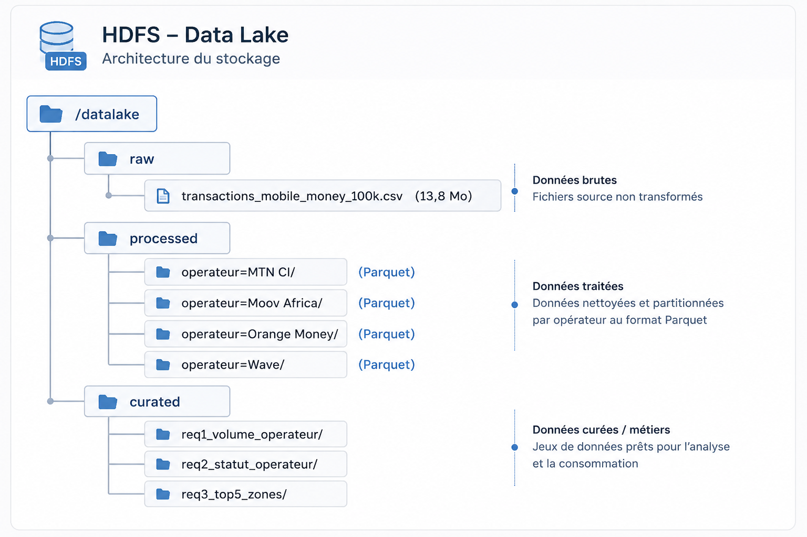

# TP3 — Data Lake Hadoop + Spark sur AWS EC2 — Transactions Mobile Money


Architecture Big Data de type **Data Lake** déployée sur le cluster Hadoop du [TP1](../01-hadoop-ec2-installation) (mode pseudo-distribué, AWS EC2), appliquée à l'analyse des **100 000 transactions Mobile Money** en Côte d'Ivoire (Wave, Orange Money, MTN CI, Moov Africa).

Le pipeline couvre l'ensemble de la chaîne : ingestion brute dans HDFS, transformation ETL avec Apache Spark (CSV → Parquet partitionné), exécution de requêtes analytiques Spark SQL, et sauvegarde des résultats métier dans une zone dédiée.

📄 Rapport complet : [`rapport_datalake_hadoop.pdf`](./rapport_datalake_hadoop.pdf)

**Auteurs :** GNAPIÉ ARIEL NATHAN, SYLLA BAZOUMANA, YAO MIÉZAN SAM WILLIAM

## Sommaire

- [Contexte](#contexte)
- [Architecture](#architecture)
- [Stack technique](#stack-technique)
- [Structure du Data Lake sur HDFS](#structure-du-data-lake-sur-hdfs)
- [Pipeline ETL](#pipeline-etl)
- [Résultats et analyses](#résultats-et-analyses)
- [Performance : CSV vs Parquet](#performance--csv-vs-parquet)
- [Difficultés rencontrées](#difficultés-rencontrées)
- [Perspectives](#perspectives)

## Contexte

**Jeu de données :** `transactions_mobile_money_100k.csv` — 100 000 transactions, janvier à juin 2024, 12 colonnes (identifiant, date/heure, opérateur, type d'opération, expéditeur, bénéficiaire, montant, frais, zones, agent, statut).

**Infrastructure :** instance EC2 `t3.micro` (2 vCPU, 1 Go RAM + 2 Go swap), Ubuntu, région `af-south-1`, cluster Hadoop en mode pseudo-distribué (le même que celui déployé au [TP1](../01-hadoop-ec2-installation)).

## Architecture

L'architecture suit le modèle **Medallion (3 zones)**, un mécanisme de gouvernance qui évite qu'un Data Lake ne devienne un « Data Swamp » :

| Zone | Rôle | Format |
|---|---|---|
| **Raw** | Copie brute du CSV source, aucune transformation | CSV |
| **Processed** | Données nettoyées, typées et partitionnées par opérateur | Parquet + Snappy |
| **Curated** | Résultats des analyses métier, prêts à consommer | CSV |



## Stack technique

| Composant | Rôle |
|---|---|
| **AWS EC2** | Infrastructure de calcul (instance unique, mode pseudo-distribué) |
| **Hadoop 3.4.3 / HDFS** | Stockage distribué, tolérant aux pannes, blocs de 128 Mo |
| **Apache Spark 3.5.1** | Moteur ETL (PySpark) et analytique (Spark SQL), traitement en mémoire |
| **Apache Parquet** | Format colonnaire compressé (Snappy), optimisé pour l'analytique |
| **AWS S3 + AWS CLI** | Source du fichier brut, interopérabilité cloud ↔ on-premise |

Spark a été préféré à MapReduce pour sa vitesse (traitement en mémoire, jusqu'à 100x plus rapide sur charges itératives) et sa richesse d'API (DataFrames, Spark SQL).

## Structure du Data Lake sur HDFS

```
/datalake
├── raw/
│   └── transactions_mobile_money_100k.csv        (13,21 Mo)
├── processed/
│   ├── operateur=MTN CI/            (Parquet)
│   ├── operateur=Moov Africa/       (Parquet)
│   ├── operateur=Orange Money/      (Parquet)
│   └── operateur=Wave/              (Parquet)
└── curated/
    ├── req1_volume_operateur/
    ├── req2_statut_operateur/
    └── req3_top5_zones/
```

Le partitionnement Parquet par colonne `operateur` crée 4 sous-répertoires physiques. Lorsqu'une requête filtre sur un opérateur, Spark n'accède qu'à la partition correspondante (**partition pruning**), réduisant le volume de données lues de 75 % pour les requêtes mono-opérateur.

## Pipeline ETL

Script `etl_mobilemoney.py` — lecture du CSV depuis HDFS (zone Raw), inférence de schéma, écriture en Parquet partitionné (zone Processed) :

```python
from pyspark.sql import SparkSession

spark = SparkSession.builder \
    .appName("ETL-MobileMoney-CSV-to-Parquet") \
    .config("spark.executor.memory", "512m") \
    .config("spark.driver.memory", "512m") \
    .config("spark.hadoop.fs.defaultFS", "hdfs://localhost:9000") \
    .getOrCreate()

df = spark.read.option("header", "true") \
    .option("inferSchema", "true") \
    .csv("hdfs://localhost:9000/datalake/raw/transactions_mobile_money_100k.csv")

df.write.mode("overwrite") \
    .partitionBy("operateur") \
    .parquet("hdfs://localhost:9000/datalake/processed/")
```

Exécution : `spark-submit --master local[2] --driver-memory 512m --executor-memory 512m ~/etl_mobilemoney.py`

## Résultats et analyses

### 1. Volume des transactions par opérateur

| Opérateur | Nb Transactions | Volume Total (FCFA) | Part de marché |
|---|---|---|---|
| Wave | 25 122 | 4 643 339 719 | 25,1 % |
| Orange Money | 25 097 | 4 633 409 970 | 25,1 % |
| Moov Africa | 25 088 | 4 636 951 482 | 25,1 % |
| MTN CI | 24 693 | 4 551 368 564 | 24,7 % |

Marché très équilibré : écart de seulement 1,7 % entre le leader (Wave) et le dernier (MTN CI).

### 2. Taux de succès par opérateur

| Opérateur | Succès | Échec | En attente | Taux de succès |
|---|---|---|---|---|
| Wave | 20 100 | 2 495 | 2 527 | 80,0 % |
| Orange Money | 20 050 | 2 501 | 2 496 | 79,9 % |
| Moov Africa | 20 072 | 2 521 | 2 495 | 80,0 % |
| MTN CI | 19 817 | 2 428 | 2 448 | 80,3 % |

L'homogénéité des taux (79,9 % – 80,3 %) suggère des causes d'échec liées au comportement des utilisateurs (couverture réseau, solde insuffisant) plutôt qu'à des défaillances techniques propres à un opérateur.

### 3. Top 5 des zones expéditrices

| Rang | Zone | Nb Transactions | % du total |
|---|---|---|---|
| 1 | Abidjan-Adjamé | 10 093 | 10,1 % |
| 2 | San Pedro | 10 083 | 10,1 % |
| 3 | Abidjan-Cocody | 10 059 | 10,1 % |
| 4 | Korhogo | 10 040 | 10,0 % |
| 5 | Man | 10 016 | 10,0 % |

La présence de Korhogo (Nord) et Man (Ouest) confirme la pénétration du Mobile Money dans les villes secondaires, au-delà du seul pôle abidjanais.

## Performance : CSV vs Parquet

Même requête `GROUP BY operateur` exécutée sur le CSV brut (zone Raw) et sur le Parquet partitionné (zone Processed) :

| Métrique | CSV | Parquet | Gain |
|---|---|---|---|
| Temps d'exécution | 12 155 ms | 2 207 ms | **▼ 81,8 %** |
| Format | Texte ligne par ligne | Colonnaire + Snappy | — |
| Partitionnement | Non | Oui (4 partitions) | — |
| Lecture sélective des colonnes | Non (scan complet) | Oui (projection) | — |
| Predicate pushdown | Non | Oui | — |

Le gain s'explique par la combinaison de la lecture colonnaire (Spark ne lit que les colonnes nécessaires), de la compression Snappy, et du partition pruning activé par le partitionnement par opérateur.

## Difficultés rencontrées

- **Erreur `Incomplete HDFS URI, no host`** avec l'URI `hdfs:///datalake/...` (triple slash) → résolue en spécifiant l'URI complète `hdfs://localhost:9000` via `spark.hadoop.fs.defaultFS`.
- **Contrainte mémoire du `t3.micro`** (1 Go RAM) → mémoire swap de 2 Go configurée, mémoire Spark limitée à 512 Mo (driver et executor), exécution en mode local (`--master local[2]`) plutôt que sur YARN.

## Perspectives

- Soumission des jobs sur **YARN** (`--master yarn`) pour exploiter pleinement la gestion des ressources Hadoop
- **Hive Metastore** pour créer des tables externes sur les partitions Parquet, interrogeables en SQL standard
- **Kafka + Spark Streaming** pour une ingestion en temps réel (architecture Lambda)
- **Apache Iceberg / Delta Lake** pour des tables transactionnelles ACID avec time-travel
- **Apache Superset / Grafana** pour des tableaux de bord dynamiques
- Migration vers un **cluster multi-nœuds** pour exploiter le parallélisme distribué réel
